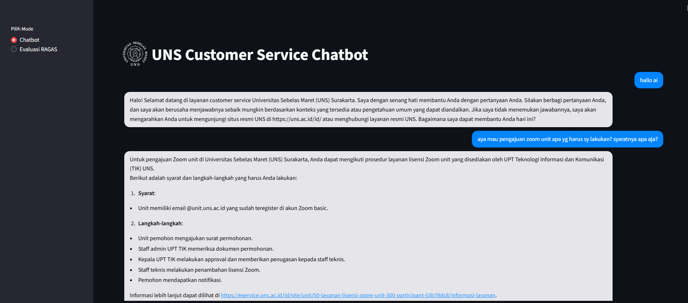

# UNS Customer Service Chatbot

Chatbot ini dirancang untuk memberikan layanan informasi seputar Universitas Sebelas Maret (UNS) Surakarta.  
Sistem menggunakan pendekatan **Retrieval-Augmented Generation (RAG)** dengan model **Groq LLaMA 4 Scout 17B Instruct** dan dilengkapi fitur evaluasi kualitas jawaban menggunakan **RAGAS**.


---

## 1. Metode yang Digunakan

### a. Retrieval-Augmented Generation (RAG)
Metode RAG menggabungkan **retrieval** dan **generation**:
1. **Retrieval** – Sistem mengambil dokumen relevan dari *Knowledge Base* (menggunakan FAISS vector store).
2. **Augmented Prompting** – Dokumen relevan digabungkan dengan pertanyaan pengguna untuk membentuk prompt.
3. **Generation** – LLM menghasilkan jawaban berdasarkan prompt yang sudah diperkaya konteks.

Kelebihan metode RAG:
- Mengurangi halusinasi model.
- Menyediakan jawaban faktual sesuai data di basis pengetahuan.
- Dapat diperbarui tanpa perlu *fine-tuning* ulang LLM.

---

## 2. Alur Proses Sistem

### Diagram Alur
User Input → Retrieval Context → Prompt Construction → LLM Response → (Opsional) Evaluasi RAGAS


### Langkah-langkah:
1. **User Mengirim Pertanyaan**
   - Pertanyaan diterima oleh antarmuka **Streamlit**.
2. **Pengambilan Konteks**
   - `KnowledgeBaseManager` mencari dokumen relevan dari FAISS database.
3. **Penyusunan Prompt**
   - `LLMProcess` membuat *system prompt* dan *user prompt* berdasarkan template `PROMPT_COSTUMER_SERVICE`.
4. **Generasi Jawaban**
   - LLM Groq (`meta-llama/llama-4-scout-17b-16e-instruct`) menghasilkan jawaban.
5. **Tampilan Jawaban**
   - Jawaban ditampilkan dalam format *chat bubble*.
6. **Evaluasi Kualitas Jawaban (Opsional)**
   - Menggunakan **RAGAS** untuk menilai kualitas jawaban.

---

## 3. Evaluasi Menggunakan RAGAS

**RAGAS** (Retrieval-Augmented Generation Assessment) digunakan untuk mengukur kualitas jawaban chatbot pada tiga aspek:

| Metrik            | Fungsi                                                                                 | Interpretasi Skor |
|-------------------|----------------------------------------------------------------------------------------|-------------------|
| **Faithfulness**   | Mengukur seberapa konsisten dan faktual jawaban terhadap informasi yang ada di konteks. Skor tinggi berarti minim atau tanpa halusinasi.                       | 1.0 = sepenuhnya faktual |
| **Context Recall** | Mengukur kelengkapan informasi dari konteks yang digunakan dalam jawaban.              | 1.0 = semua info relevan digunakan |
| **Context Precision** | Mengukur ketepatan informasi yang diambil dari konteks (tidak membawa info yang salah/irrelevan). | 1.0 = semua info yang dipakai relevan |

### Proses Evaluasi:
1. Ambil pertanyaan (`question`), jawaban chatbot (`answer`), konteks yang di-*retrieve* (`contexts`), dan jawaban benar (`ground_truth`).
2. Bentuk dataset RAGAS:
```python
data = Dataset.from_dict({
    "question": [question],
    "answer": [generated_answer],
    "contexts": [[retrieved_context]],
    "ground_truth": [ground_truth]
})
```

### Instalasi
1. create environment python
2. open repository
``` bash
cd Chatbot_RAG
pip install -r requirements.txt
```
3. cara run
``` bash
streamlit run chatbot.py --server.port {your port}
```